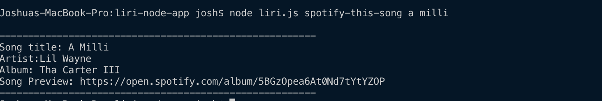
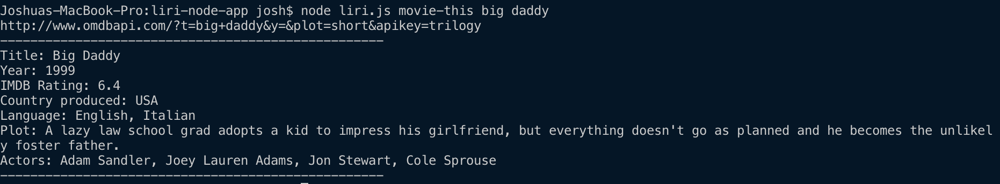
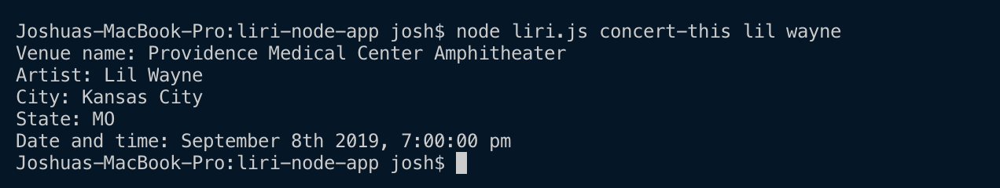

# liri-node-app

The purpose of the liri app is to provide the user with fast information on tour dates and times, information on a song or to tell you information about a movie.

The user can use three different ways to get inormation:
    1) "node liri.js concert this <Artist-name>" to recieve the venue name, artist name, city and state and the date and time of shows.
    2) "node liri.js spotify-this-song <song-title>" to receive the song title, artist(s), album name and a song preview link.
    3) "node liri.js movie-this <movie-title>" to receieve the movie title, the year it was filmed, the IMDB rating, country it was produced in, language(s), plot and actors. 
    

    

Github link: https://jmlagorce.github.io/liri-node-app/

Technologies used: JS, Node.js, moment.js, spotify-node-api, axios

role: I created the whoel functionallity of the app

